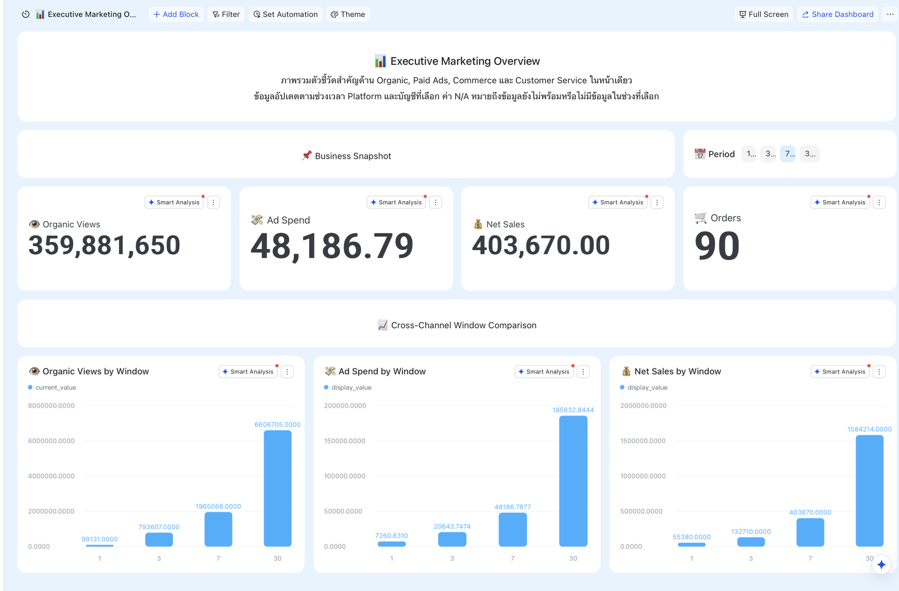
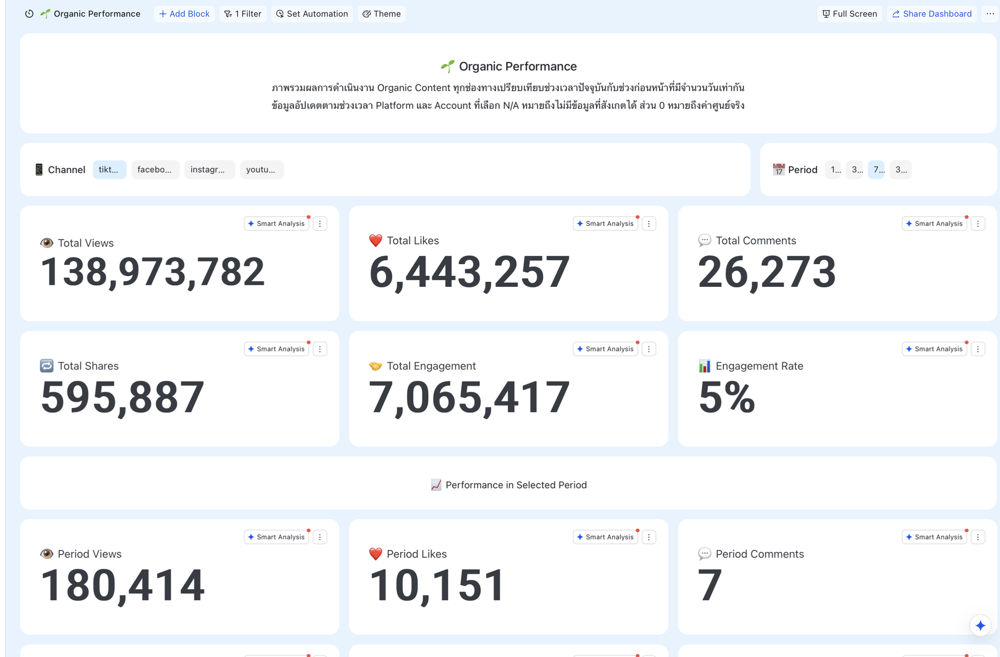
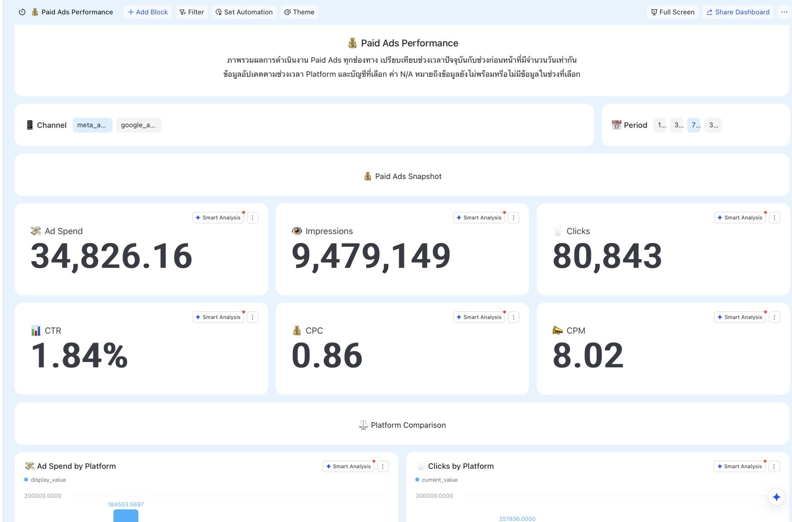
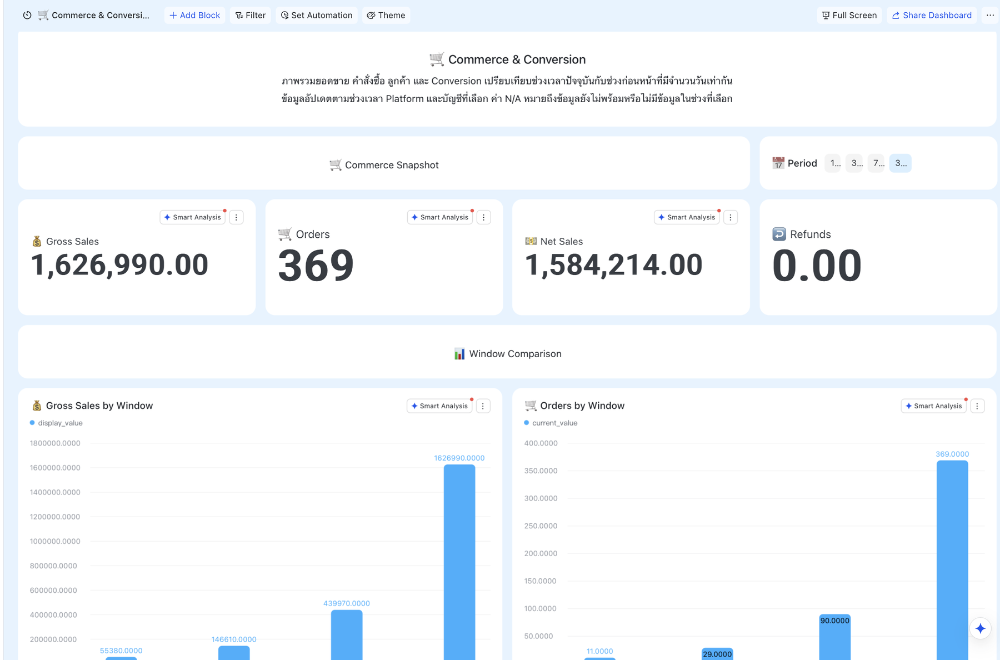
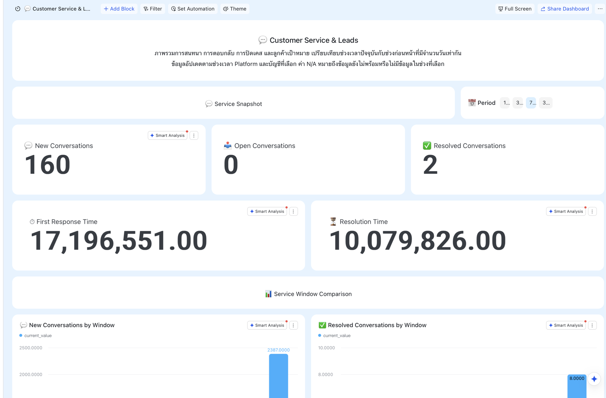
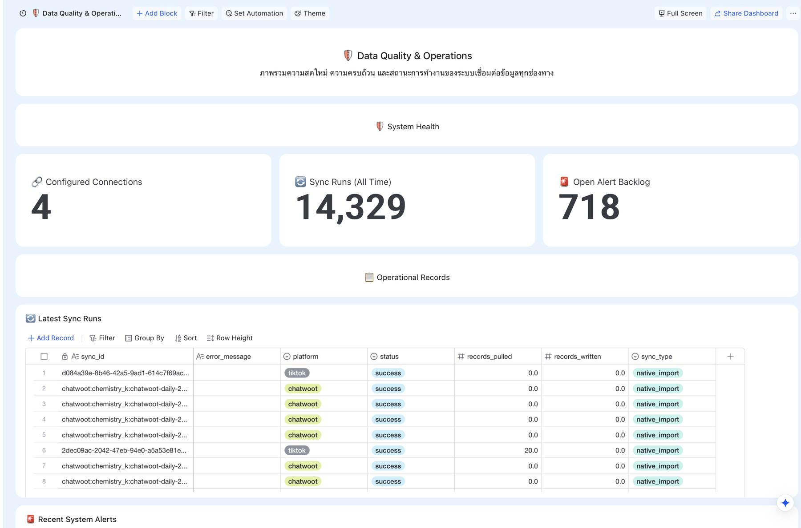

# คู่มือ Social MKT Data Hub

คู่มือนี้อธิบายวิธีอ่าน Dashboard และตารางใน Lark Base รวมถึงที่มาของข้อมูลและเงื่อนไขสำคัญที่ควรรู้ ระบบเก็บประวัติหลักไว้ใน Cloudflare D1 และส่งข้อมูลที่ใช้ดูงานไปยัง Lark Base

## วิธีอ่านวันที่

- `metric_date` = วันที่ที่ตัวเลขนั้นเกิดขึ้น โดยรอบรายวันใช้วันล่าสุดที่ข้อมูลเสร็จสมบูรณ์แล้ว
- `last_sync_at` = วันที่และเวลาที่เขียนข้อมูลลงปลายทางสำเร็จ จึงอาจเป็นวันถัดจาก `metric_date`
- `period_start` / `period_end` = วันแรกและวันสุดท้ายของช่วงที่ใช้คำนวณรายงาน
- ค่า `0` หมายถึงแหล่งข้อมูลยืนยันว่าเป็นศูนย์ ส่วนข้อมูลที่ไม่มีหรือยังไม่พร้อมจะแสดงเป็นช่องว่างหรือ `N/A`

## Dashboard

ตัวเลขบน Dashboard มาจากรายงานที่ระบบคำนวณและตรวจความครบถ้วนแล้ว ผู้ใช้กรองข้อมูลตาม Platform, Account และช่วงเวลา 1 Day (`1D`), 3 Days (`3D`), 7 Days (`7D`) หรือ 30 Days (`30D`) ได้ หากข้อมูลฐานสำหรับเปรียบเทียบยังไม่ครบ ช่องนั้นจะแสดงเป็นช่องว่างหรือ `N/A` โดยไม่ใช้เลขศูนย์แทนข้อมูลที่ขาด ภาพในคู่มือเป็นตัวอย่างหน้าจอ ณ วันที่จัดทำ ตัวเลขจริงจะเปลี่ยนตามรอบ Sync และตัวกรองที่เลือก

### 📊 Executive Marketing Overview

ใช้ดูภาพรวม Organic, Paid Ads, ยอดขาย และงานบริการลูกค้าในหน้าเดียว

| บล็อก | รูปแบบ | ค่าที่แสดง |
|---|---|---|
| Organic Total Views | ตัวเลขสรุป | ยอดดูสะสมล่าสุดรวมของ Content ทั้งหมดใน Platform และ Account ที่เลือก |
| Organic Views by Window | ตัวเลขตามช่วง | ยอดดูที่เพิ่มขึ้นภายในช่วง 1 Day (`1D`), 3 Days (`3D`), 7 Days (`7D`) หรือ 30 Days (`30D`) |
| Orders | ตัวเลขสรุป | จำนวนออเดอร์ WooCommerce ที่ระบบรับรองในช่วงรายงาน |
| Net Sales | ตัวเลขสรุป | ยอดขายสุทธิหลังหักส่วนลด คืนเงิน และรายการปรับปรุงตามนิยามของร้าน |
| Net Sales by Window | ตัวเลขตามช่วง | ยอดขายสุทธิแยกตามช่วงเวลาที่เลือก |
| Ad Spend | ตัวเลขสรุป | ค่าโฆษณารวมจากบัญชี Paid Ads ที่เชื่อมต่อ |
| Ad Spend by Window | ตัวเลขตามช่วง | ค่าโฆษณาแยกตามช่วงเวลาที่เลือก |
| Trend | กราฟตามเวลา | แนวโน้ม Organic Views, Net Sales หรือ Ad Spend ตามตัวกรอง |
| Top Content | ตารางอันดับ | ชื่อ/ลิงก์ Content, Platform และค่าผลงานหลักในช่วงรายงาน |
| Top Ads | ตารางอันดับ | Campaign/Ad, Platform, Spend และค่าผลงานหลักในช่วงรายงาน |
| Data Readiness | สถานะข้อมูล | วันที่ข้อมูลล่าสุดและความพร้อมของข้อมูลที่นำมาสรุป |
| Data Quality | สถานะข้อมูล | ความครบถ้วนของช่วงข้อมูลและสาเหตุที่บางค่าแสดงเป็น `N/A` |

### 🌱 Organic Performance

ใช้ดูผลงาน Facebook, Instagram, TikTok และ YouTube ทั้งยอดล่าสุดและยอดที่เกิดขึ้นในช่วงที่เลือก

| บล็อก | รูปแบบ | ค่าที่แสดง |
|---|---|---|
| Total Views | ตัวเลขสรุป | ยอดดูสะสมล่าสุดรวมของ Content ใน Platform และ Account ที่เลือก |
| Total Likes | ตัวเลขสรุป | ยอดถูกใจสะสมล่าสุดรวมของ Content ในขอบเขตที่เลือก |
| Total Comments | ตัวเลขสรุป | ยอดความคิดเห็นสะสมล่าสุดรวมของ Content ในขอบเขตที่เลือก |
| Total Shares | ตัวเลขสรุป | ยอดแชร์สะสมล่าสุดรวมของ Content ในขอบเขตที่เลือก |
| Total Engagement | ตัวเลขสรุป | Engagement สะสมล่าสุดรวมตาม Metric ที่แต่ละ Platform รองรับ |
| Current Engagement Rate | ตัวเลขสรุป | อัตรา Engagement ล่าสุดที่ระบบคำนวณจากข้อมูลในขอบเขตที่เลือก |
| Period Views | ตัวเลขตามช่วง | ยอดดูที่เพิ่มขึ้นระหว่างวันเริ่มต้นและวันสิ้นสุดของช่วงที่เลือก |
| Period Likes | ตัวเลขตามช่วง | ยอดถูกใจที่เพิ่มขึ้นระหว่างวันเริ่มต้นและวันสิ้นสุดของช่วงที่เลือก |
| Period Comments | ตัวเลขตามช่วง | ยอดความคิดเห็นที่เพิ่มขึ้นระหว่างวันเริ่มต้นและวันสิ้นสุดของช่วงที่เลือก |
| Period Shares | ตัวเลขตามช่วง | ยอดแชร์ที่เพิ่มขึ้นระหว่างวันเริ่มต้นและวันสิ้นสุดของช่วงที่เลือก |
| Period Engagement | ตัวเลขตามช่วง | Engagement ที่เพิ่มขึ้นภายในช่วงที่เลือก |
| Period Engagement Rate | ตัวเลขตามช่วง | อัตรา Engagement ที่คำนวณจากค่าที่เกิดขึ้นภายในช่วงที่เลือก |
| Tracked Content | จำนวนรายการ | จำนวน Content ที่อยู่ในการคำนวณ |
| New Content | จำนวนรายการ | จำนวน Content ที่เผยแพร่ใหม่ในช่วงที่เลือก |
| Baseline Covered Content | จำนวนรายการ | จำนวน Content ที่มีข้อมูลฐานเพียงพอสำหรับหาค่าเพิ่มขึ้น |
| Baseline Missing Content | จำนวนรายการ | จำนวน Content ที่ยังไม่มีข้อมูลฐานเพียงพอ |
| Baseline Coverage Rate | เปอร์เซ็นต์ | สัดส่วน Content ที่พร้อมคำนวณค่าตามช่วง |
| Trend | กราฟตามเวลา | แนวโน้ม Views และ Engagement ตามวัน |
| Platform Comparison | กราฟเปรียบเทียบ | เปรียบเทียบค่าหลักระหว่าง Facebook, Instagram, TikTok และ YouTube |
| Top Content | ตารางอันดับ | Content ที่ผลงานสูงสุด พร้อม Platform, วันที่เผยแพร่ และ Metric หลัก |
| Data Quality | สถานะข้อมูล | ความครบถ้วนของช่วงข้อมูล; ค่าตามช่วงเป็น `N/A` เมื่อ Baseline ยังไม่ครบ |

### 💰 Paid Ads Performance

ใช้ดูประสิทธิภาพโฆษณาของ Meta Ads, Google Ads และ TikTok Ads

| บล็อก | รูปแบบ | ค่าที่แสดง |
|---|---|---|
| Spend | ตัวเลขสรุป | ค่าโฆษณารวมของบัญชีและ Campaign ที่อยู่ในช่วงและตัวกรองที่เลือก |
| Impressions | ตัวเลขสรุป | จำนวนครั้งรวมที่โฆษณาถูกแสดงในช่วงที่เลือก |
| Clicks | ตัวเลขสรุป | จำนวนคลิกรวมที่แหล่งโฆษณารายงานในช่วงที่เลือก |
| CTR | ตัวเลขสรุป | สัดส่วน Clicks ต่อ Impressions ในช่วงที่เลือก |
| CPC | ตัวเลขสรุป | ค่าใช้จ่ายเฉลี่ยต่อหนึ่ง Click ในช่วงที่เลือก |
| CPM | ตัวเลขสรุป | ค่าใช้จ่ายเฉลี่ยต่อการแสดงโฆษณา 1,000 ครั้งในช่วงที่เลือก |
| Trend | กราฟตามเวลา | แนวโน้ม Spend, Impressions, Clicks และ Metric ที่รองรับตามวัน |
| Spend by Platform | กราฟเปรียบเทียบ | ค่าโฆษณาแยก Meta, Google และ TikTok |
| Clicks by Platform | กราฟเปรียบเทียบ | จำนวนคลิกแยก Platform |
| Top Ads | ตารางอันดับ | Campaign/Ad, Platform, Spend, Impressions, Clicks และ Conversion เมื่อแหล่งข้อมูลส่งมา |
| Data Quality | สถานะข้อมูล | บัญชีที่รวมในรายงาน ช่วงข้อมูล และ Metric ที่ยังไม่มีจากต้นทาง |

### 🛒 Commerce & Conversion

ใช้ดูยอดขายจาก WooCommerce หลังรวมยอดและตรวจสถานะออเดอร์แล้ว

| บล็อก | รูปแบบ | ค่าที่แสดง |
|---|---|---|
| Orders | ตัวเลขสรุป | จำนวนออเดอร์ที่ผ่านเงื่อนไขการรับรองของระบบในช่วงที่เลือก |
| Orders by Window | ตัวเลขตามช่วง | จำนวนออเดอร์ในช่วง 1 Day (`1D`), 3 Days (`3D`), 7 Days (`7D`) หรือ 30 Days (`30D`) |
| Gross Sales | ตัวเลขสรุป | ยอดขายก่อนหักส่วนลด คืนเงิน และรายการปรับปรุงตามนิยามร้าน |
| Gross Sales by Window | ตัวเลขตามช่วง | ยอดขายก่อนหักส่วนลด คืนเงิน และรายการปรับปรุง แยกตามช่วงที่เลือก |
| Net Sales | ตัวเลขสรุป | ยอดขายสุทธิในช่วงที่เลือก |
| Refunds | ตัวเลขสรุป | ยอดคืนเงินที่บันทึกในช่วงที่เลือก |
| Trend | กราฟตามเวลา | แนวโน้ม Orders, Gross Sales, Net Sales และ Refunds ตามวัน |
| อันดับสินค้า วิธีชำระเงิน และวิธีจัดส่ง | ตารางอันดับ | อันดับและยอดขายที่เกี่ยวข้อง เมื่อแหล่งข้อมูลมีรายละเอียดส่วนนั้น |
| Data Quality | สถานะข้อมูล | วันที่ข้อมูลล่าสุด ความครบถ้วน และสถานะข้อมูลจาก WooCommerce |

### 💬 Customer Service & Leads

ใช้ดูงานบริการลูกค้าจาก Chatwoot โดยนำเข้าเฉพาะ Conversation ใหม่และรายการเดิมที่มีการอัปเดต

| บล็อก | รูปแบบ | ค่าที่แสดง |
|---|---|---|
| New Conversations | ตัวเลขสรุป | จำนวน Conversation ที่ลูกค้าเริ่มใหม่ภายในช่วงที่เลือก |
| New Conversations by Window | ตัวเลขตามช่วง | จำนวน Conversation ใหม่ในช่วง 1 Day (`1D`), 3 Days (`3D`), 7 Days (`7D`) หรือ 30 Days (`30D`) |
| Open Conversations | ตัวเลขสรุป | จำนวน Conversation ที่ยังเปิดอยู่ ณ จุดสรุปข้อมูล |
| Resolved Conversations | ตัวเลขสรุป | จำนวน Conversation ที่ปิดงานแล้วในช่วงที่เลือก |
| Resolved Conversations by Window | ตัวเลขตามช่วง | Conversation ที่ปิดแล้วแยกตามช่วงเวลา |
| First Response Time | ตัวเลขสรุป | เวลาเฉลี่ยตั้งแต่ลูกค้าเริ่ม Conversation จนได้รับคำตอบครั้งแรก |
| Resolution Time | ตัวเลขสรุป | เวลาเฉลี่ยตั้งแต่เปิด Conversation จนปิดงาน |
| Trend | กราฟตามเวลา | แนวโน้ม Conversation ใหม่ เปิดอยู่ และปิดแล้วตามวัน |
| Agent/Inbox Ranking | ตารางอันดับ | จำนวนงานและเวลาตอบแยกตาม Agent หรือ Inbox เมื่อมีข้อมูลเพียงพอ |
| Data Quality | สถานะข้อมูล | วันที่ข้อมูลล่าสุด จำนวนรายการที่นำมาคำนวณ และส่วนที่ยังไม่ครบ |

### 🛡️ Data Quality & Operations

ใช้ตรวจสุขภาพระบบ และช่วยแยกว่าค่าเป็นศูนย์จริงหรือข้อมูลยังมาไม่ครบ

| บล็อก | รูปแบบ | ค่าที่แสดง |
|---|---|---|
| Freshness | สถานะเวลา | วันที่ข้อมูลล่าสุด เวลาที่สร้างรายงาน และเวลาที่ Sync สำเร็จล่าสุด |
| Coverage | เปอร์เซ็นต์/จำนวน | อัตราความครบถ้วน จำนวนรายการที่พร้อมคำนวณ และจำนวนที่ขาด Baseline |
| Data Status | ป้ายสถานะ | `complete`, `partial`, `no_data` หรือ `source_unavailable` ตามหลักฐานของรอบนั้น |
| Connector Health | สถานะระบบ | สถานะ Sync ล่าสุดของแต่ละช่องทาง รวมถึงงานที่กำลังทำและงานที่ควรตรวจสอบ |
| Alerts | ตารางรายการ | ระดับความสำคัญ สาเหตุ เวลาเกิด สถานะปัจจุบัน และช่องทางที่เกี่ยวข้อง |

ตัวเลขบน Dashboard มาจาก `MKT_Report_Snapshots`, `MKT_Report_Metric_Values`, `MKT_Report_Top_Content` และ `MKT_Report_Top_Ads` ส่วนสถานะการ Sync และปัญหาของระบบอ้างอิงจาก `MKT_Sync_Log` และ `MKT_System_Alerts`

## ตารางใน Lark Base

### Master Data

| Table | แสดงอะไร | เงื่อนไขสำคัญ |
|---|---|---|
| `MKT_Accounts` | บัญชี Social ที่เชื่อมต่อ ชื่อบัญชี Platform และเวลาซิงก์ล่าสุด | 1 แถวต่อบัญชี; `last_sync_at` อัปเดตหลังเขียนปลายทางสำเร็จ |
| `MKT_Account_Daily` | ตัวเลขรวมระดับบัญชีรายวัน | 1 แถวต่อบัญชีต่อวันที่ข้อมูล |
| `MKT_Metric_Definitions` | คำอธิบาย หน่วย และวิธีอ่านแต่ละ Metric | ใช้เป็นพจนานุกรมกลางของระบบ |
| `MKT_Classification_Dictionary` | คำและกฎที่ใช้จัดหมวดหมู่ Content หรือ Campaign | แก้ไขได้เฉพาะส่วนที่กำหนดสำหรับผู้ดูแล |

### Organic Social

| Table | แสดงอะไร | เงื่อนไขสำคัญ |
|---|---|---|
| `MKT_Content` | ข้อมูลล่าสุดของ Post/Video เช่น ชื่อ ลิงก์ วันที่เผยแพร่ และยอดล่าสุด | 1 แถวต่อ Content; ซิงก์ซ้ำเป็นการอัปเดต ไม่สร้างแถวซ้ำ |
| `MKT_Content_Daily` | ตัวเลขของแต่ละ Content แยกตามวัน | เป้าหมายเก็บ 30 วันและไม่เกิน 10,000 แถว โดยเก็บแถวล่าสุดของแต่ละ Content ไว้; ประวัติเต็มยังอยู่ใน D1 |
| `RAW_TikTok_Creator_Videos` | ข้อมูล TikTok ที่เชื่อมผ่าน Lark Native | อ่านอย่างเดียว ห้ามแก้ Schema หรือข้อมูลด้วยระบบ Sync |

ประวัติ Daily ใน D1 ที่แหล่งข้อมูลยืนยันได้เริ่มวันที่ 19 มิ.ย. 2569 สำหรับ Facebook และ YouTube ส่วน Instagram เริ่มวันที่ 30 มิ.ย. และ TikTok เริ่มวันที่ 24 ก.ค. เนื่องจากสองช่องทางหลังไม่มีข้อมูล Daily ย้อนหลังจากแหล่งข้อมูล แต่ข้อมูล Post และ Video ใน `MKT_Content` ย้อนถึงวันที่ 19 มิ.ย. ครบทุกช่องทาง

### Paid Ads

| Table | แสดงอะไร | เงื่อนไขสำคัญ |
|---|---|---|
| `MKT_Ads_Accounts` | บัญชีโฆษณาและสถานะบัญชี | 1 แถวต่อบัญชีโฆษณา |
| `MKT_Ads_Campaigns` | Campaign และสถานะล่าสุด | 1 แถวต่อ Campaign |
| `MKT_Ads_AssetGroups` | Asset Group ของ Google Ads | มีข้อมูลเฉพาะประเภท Campaign ที่ใช้ Asset Group |
| `MKT_Ads_AdGroups` | Ad Group/Ad Set ภายใต้ Campaign | 1 แถวต่อกลุ่มโฆษณา |
| `MKT_Ads_Ads` | ตัวโฆษณาและสถานะล่าสุด | 1 แถวต่อ Ad |
| `MKT_Ads_Creatives` | Creative/ชิ้นงานโฆษณา | เก็บข้อมูลตัวชิ้นงาน ไม่ใช่ยอดรายวัน |
| `MKT_Ads_Daily` | Metric โฆษณารายวัน เช่น Spend, Impression, Click และ Conversion | Lark เก็บข้อมูลช่วงล่าสุด โดยมีเป้าหมายย้อนหลัง 90 วัน ส่วนประวัติเต็มยังอยู่ใน D1 |
| `📊 MKT_Ads_Campaign_Summary` | สรุปผลระดับ Campaign แยกเดือน ตั้งแต่ 19 มิ.ย. 2569 | เดือนปัจจุบันเป็น MTD และอัปเดตรายวัน; เดือนที่ปิดแล้วจะคงเดิม; มี Views Overview/Meta/Google/TikTok และไม่สร้างแถวซ้ำ |

### Commerce

| Table | แสดงอะไร | เงื่อนไขสำคัญ |
|---|---|---|
| `MKT_Commerce_Orders` | รายการออเดอร์และสถานะล่าสุด | 1 แถวต่อออเดอร์; ขอบเขตประวัติ Production เริ่มปี 2569 |
| `MKT_Commerce_Products` | สินค้าและสถานะล่าสุด | 1 แถวต่อสินค้า |
| `MKT_Commerce_Customers` | ข้อมูลลูกค้าและยอดสะสมที่ใช้ในรายงาน | 1 แถวต่อลูกค้า; ไม่แสดง Secret หรือ Credential |
| `MKT_Commerce_Daily` | ยอดขายและจำนวนออเดอร์รวมรายวัน | 1 แถวต่อร้าน/ช่องทางต่อวัน |
| `MKT_Commerce_Product_Daily` | ยอดขายระดับสินค้ารายวัน | 1 แถวต่อสินค้าต่อวัน |

### Customer Service

| Table | แสดงอะไร | เงื่อนไขสำคัญ |
|---|---|---|
| `MKT_Conversations` | สถานะล่าสุดของ Conversation จาก Chatwoot | นำเข้าเฉพาะรายการใหม่หรือรายการที่มี Revision ใหม่กว่าใน D1 |
| `MKT_Conversation_Daily` | ตัวเลขของแต่ละ Conversation แยกตามวัน | 1 แถวต่อ Conversation ต่อวันที่ข้อมูล |
| `MKT_Agent_Daily` | ผลงาน Agent รายวัน | สรุปตาม Agent และวันที่ |
| `MKT_Inbox_Daily` | ผลงาน Inbox รายวัน | สรุปตาม Inbox และวันที่ |
| `MKT_Conversation_Account_Daily` | ภาพรวม Customer Service ระดับ Account รายวัน | ใช้กับ Dashboard และรายงานภาพรวม |

### Reports, AI และ Notification

| Table | แสดงอะไร | เงื่อนไขสำคัญ |
|---|---|---|
| `MKT_Report_Settings` | การตั้งค่ารายงาน ช่วงเวลา และขอบเขตช่องทาง | แก้เฉพาะค่าที่เปิดให้ลูกค้าตั้งค่า |
| `MKT_Report_Snapshots` | ข้อมูลหลักของรายงานแต่ละ Platform และช่วงเวลา | สร้างจากข้อมูล D1 ที่ผ่านการตรวจความครบถ้วนแล้ว |
| `MKT_Report_Metric_Values` | ค่า Metric ภายในแต่ละรายงาน | ค่าไม่พร้อมเป็น `N/A` ไม่แทนด้วยศูนย์ |
| `MKT_Report_Top_Content` | Content อันดับต้นในช่วงรายงาน | อันดับผูกกับ Report snapshot เดียวกัน |
| `MKT_Report_Top_Ads` | Ads/Campaign อันดับต้นในช่วงรายงาน | อันดับผูกกับ Report snapshot เดียวกัน |
| `MKT_AI_Report_Runs` | สรุปจาก AI สถานะการสร้าง และข้อมูลอ้างอิง | AI เขียนคำอธิบายจากตัวเลขที่ระบบคำนวณแล้ว ไม่ได้คำนวณตัวเลขเอง |
| `MKT_Notification_Log` | ประวัติการส่งรายงานเข้ากลุ่ม Lark | การส่งแต่ละครั้งมีรหัสเฉพาะเพื่อป้องกันข้อความซ้ำ |

### Sync & System

| Table | แสดงอะไร | เงื่อนไขสำคัญ |
|---|---|---|
| `MKT_Sync_Log` | ผลการ Sync เวลา จำนวนแถว และสถานะ | ใช้ตรวจประวัติการทำงาน ไม่ใช่ข้อมูลธุรกิจ |
| `MKT_System_Alerts` | ปัญหาและสถานะการแก้ไข | ใช้โดยผู้ดูแลระบบ; ไม่มี Secret ในข้อความ |

## ข้อมูลใน Cloudflare

Cloudflare เป็นส่วนที่ประมวลผลและเก็บประวัติหลัก จึงไม่ควรแก้ข้อมูลใน D1 ด้วยมือ

| ส่วน | Table สำคัญ | เก็บอะไร |
|---|---|---|
| Organic | `organic_content_state`, `organic_content_observations`, `organic_account_daily_facts`, `youtube_analytics_daily_facts` | สถานะ Content ล่าสุด, ประวัติ Metric รายวัน และ Analytics |
| Paid Ads | `ads_entity_state`, `ads_daily_facts`, `ads_conversion_daily_facts` | สถานะ Campaign/Ad ล่าสุด, Metric รายวัน และประวัติการเปลี่ยนแปลงของ Conversion |
| Commerce | `commerce_*`, `raw_commerce_*` | Store/Product/Order/Customer ปัจจุบัน ข้อมูลรับเข้า และยอดรวมรายวัน |
| Chatwoot | `chatwoot_*_state`, `chatwoot_*_daily_facts`, `chatwoot_reporting_event_facts` | สถานะ Conversation/Agent/Inbox และสถิติรายวัน |
| Report | `report_materializations`, `report_requests` | รายงานที่คำนวณเสร็จแล้วและคำขอสร้างรายงาน |
| Notification | `lark_notification_deliveries` | สถานะการจองงาน ส่งข้อความ และบันทึกผล เพื่อป้องกันการส่งซ้ำ |
| Coverage | `data_coverage_runs`, `data_coverage_entities` | หลักฐานว่าข้อมูลแต่ละช่วงครบ บางส่วน หรือยังไม่พร้อม |
| Sync/Queue | `sync_jobs`, `sync_runs`, `sync_cursors`, `sync_locks`, `sync_work_runs`, `sync_work_phases`, `sync_work_units` | งาน Sync จุดบันทึกความคืบหน้า และสถานะล็อก เพื่อให้ระบบทำต่อจากจุดเดิมได้ |
| Error/Recovery | `queue_operation_attempts`, `dead_letter_jobs`, `dead_letter_operation_metadata`, `system_alerts`, `sync_warning_outbox` | ประวัติการทำงานของ Queue งานที่ล้มเหลว และการแจ้งเตือนสำหรับการกู้คืนแบบควบคุม |
| Connection | `connections`, `encrypted_credentials`, `oauth_state_attempts`, `connection_invitations`, `connection_identity_selections` | ข้อมูลการเชื่อมบัญชีและ Credential ที่เข้ารหัสแล้ว |
| Google Ads ingress | `google_ads_delivery_*`, `google_ads_live_admissions`, `google_ads_signing_provisioning_tickets` | ชุดข้อมูลที่รับจาก Manager Script และหลักฐานยืนยันคำขอ |

## ข้อควรระวัง

- อย่าแก้ Primary/Stable key, Platform, Account ID หรือวันที่ด้วยมือ เพราะระบบใช้ข้อมูลเหล่านี้ป้องกันแถวซ้ำและตรวจเทียบกับ D1
- ตาราง Daily ใน Lark ใช้แสดงผลและเก็บข้อมูลช่วงล่าสุด การลดจำนวนแถวใน Lark ไม่ได้ลบประวัติที่เก็บไว้ใน D1
- หาก Dashboard ว่าง ให้ดู `Data Quality & Operations`, `MKT_Sync_Log` และ `MKT_System_Alerts` ก่อนสรุปว่า Metric เป็นศูนย์
